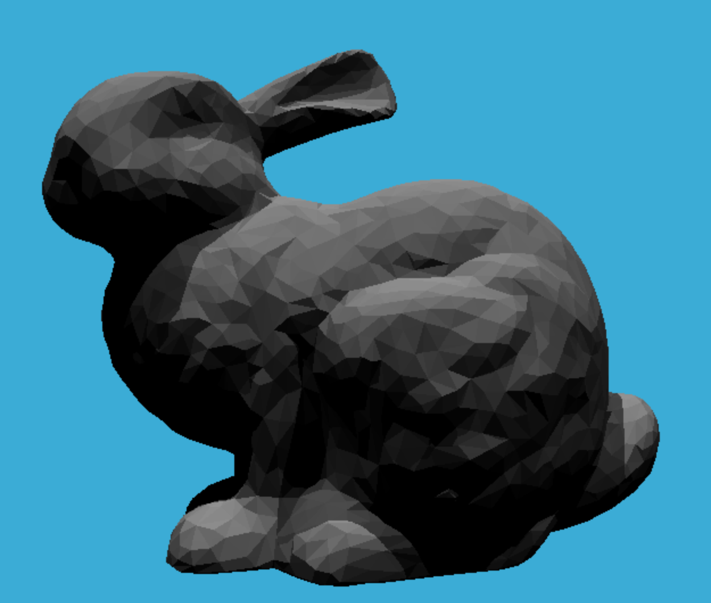

# GAMES101-Assignments

- For each folder, you may simply run the demo by executing *run_demo.sh*:

    ```
    bash run_demo.sh
    ```

- The output of each assignment:
    - ​	Assignment1:

    - ​	Assignment2:

    - ​	Assignment3:
        - <p align="center">
            
            
            </p>
        
        - <p align="center">
            
            
            </p>
        
    - ​	Assignment4:

    

    - ​	Assignment5:

    <p align="center">
    
    </p>

    - ​	Assignment6:

    <p align="center">
    
    </p>

    - ​	Assignment7: